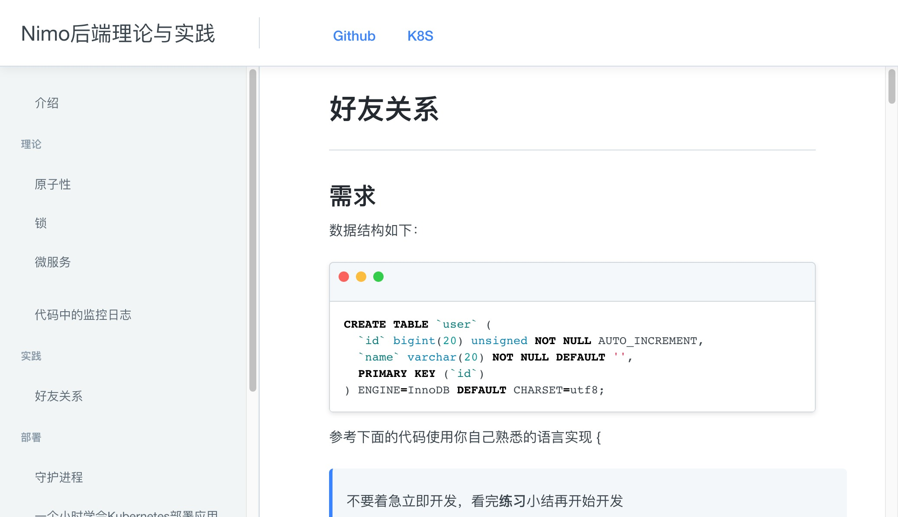

# 2type/gitbook

> gitbook 在国内访问速度慢,而且可能打开崩溃完全不可用,所以我做了一个 jekyll 版 gitbook主题,可以自行部署静态资源在各大平台.

示例项目 [https://be.nimo.run](https://be.nimo.run)

[](https://be.nimo.run)


开启 Github Pages 后 新建 `_config.yml` 文件

内容为

```yaml
title: 你的网站标题
remote_theme: 2type/gitbook
```
## 页面

新建 readme.md 文件

    ---
    permalink: /
    ---
    # 标题 
    
    内容**加粗**
    ## 章节1 <a id="hash_name"></a>
    abc

### permalink
在 markdown 文件顶部配置 permalink 可自定义 URL 
```
---
permalink: /some/
---
```

## 定义页面内容

* 修改左侧导航 [./_includes/SUMMARY.html](./_includes/SUMMARY.html?blob)
* 修改头部导航 [./_includes/HEADER_LINKS.html](./_includes/HEADER_LINKS.html?blob)
* 修改底部 [./_includes/FOOTER.html](./_includes/FOOTER.html?blob)

## 基于内容生成侧栏

在 markdown 文件顶部配置 `sidebarBasedOnContent: true` 
侧栏将不使用 `_includes/SUMMARY.html` 文件,而是自动基于页面内容生成侧栏

```
---
sidebarBasedOnContent: true
---
```


## 代码

### blob

给链接添加 `?blob` 后缀后会自动将链接转换为 github 地址

例如: 
```
[_config.yml](./_config.yml?blob)
```

[_config.yml](./_config.yml?blob)

### embed

给链接添加 `?embed` 后缀将代码嵌入到页面

例如: 
```
[_config.yml](./_config.yml?embed)
```

[_config.yml](./_config.yml?embed)

### 锚点
 
```
## 章节1 <a id="hash_name"></a>
```
在标题后面加带 id 的空 a 标签,可以实现自定义锚点   

## 样式

修改 [./assets/var.css](./assets/var.css?embed) 文件可自定义主题颜色

随后创建的 `_config.yaml` 只需设置为 `remote_theme: 用户名或组织名/gitbook`

## 继承

你可以 fork 本项目后修改 `_includes` 文件下的文件.然后再你的新项目的新建 `_config.yaml`

```yaml
remote_theme: 你的用户名或组织名/gitbook
```

这样就可以统一管理公用部分了

## 部署jekyll  <a id="publish_jeykyll"></a>

根目录新建 `Gemfile` 文件

```gemfile
source "https://rubygems.org"
gem 'github-pages', group: :jekyll_plugins
```

有些平台必须通过 `/practice/friends.html` 才能访问页面,而不能通过 `/practice/friends/`

### vercel

在 `https://vercel.com/` 需要在每个markdown文件都配置`permalink`

```
---
permalink: /practice/friends/
---
```

在 `https://vercel.com/用户名/项目/settings` 页面中将

`Build & Development Settings` 栏目打开 OVERRIDE
将 `BUILD COMMAND设置为` 设置为
`bundle exec jekyll build` 

在 `https://vercel.com/用户名/项目/settings/environment-variables` 页面中

添加 
NAME: `VERCEL_GIT_REPO_OWNER`
VALUE: `用户名/项目` 例如 `nimoc/be`

## 本地开发

https://jekyllrb.com/docs/

```
# 监听文件修改更新页面
bundle exec jekyll serve
# 构建静态文件
bundle exec jekyll build
```

## TODO

1. [ ] 扫描页面导航在文章底部加载下一个文章和上一个文章
